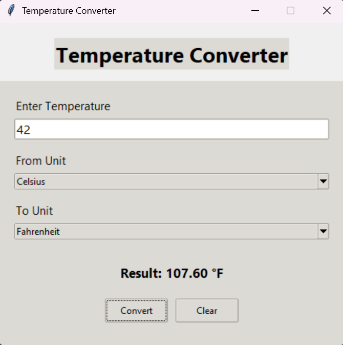

# Temperature Converter

A simple and user-friendly Temperature Converter application built using Python and Tkinter.

## Features

* Celsius → Fahrenheit
* Fahrenheit → Celsius
* Celsius → Kelvin
* Kelvin → Celsius
* Fahrenheit → Kelvin
* Kelvin → Fahrenheit
* Modern GUI using Tkinter and ttk widgets
* Input validation for invalid entries
* Clear button to reset fields
* Real-time temperature conversion

## Technologies Used

* Python
* Tkinter
* ttk

## GitHub Repository

https://github.com/devanshu-dev0710/SCT_SE_1

## Project Structure

```text
SCT_SE_1
│
├── main.py
├── README.md
├── screenshots/
├── .gitignore
└── venv/
```

## How to Run

1. Clone the repository:

```bash
git clone https://github.com/devanshu-dev0710/SCT_SE_1.git
```

2. Navigate to the project folder:

```bash
cd SCT_SE_1
```

3. Run the application:

```bash
python main.py
```

## Screenshot

Add your application screenshot inside the `screenshots` folder and update the filename below if needed:

```markdown

```

## Author

Devanshu
